## HOW TO: Create your OWN Hosting by your ANDROID PHONE!
You think hosting service is expensive?? Actually, yes it is lol. But i'll provide you some cheap

## 🔍 System Overview
- Device: Mi 11 Lite (aarch64)
- OS: Ubuntu Server via UserLand
- Web Server: Nginx (port 8080)
- Domain: Managed via Cloudflare
- Access: Cloudflare Tunnel + Zero Trust
- SSL: Provided by Cloudflare

## 🧰 System Requirements
- Hardware: Mi 11 Lite
- Software: UserLand, PuTTY, GitHub, Microsoft Word

## 🏗️ Project Stages
### 1. Preparing the Device
Install Ubuntu on Android using UserLand. Minimal terminal environment is preferred.

Open the app and choose Ubuntu 

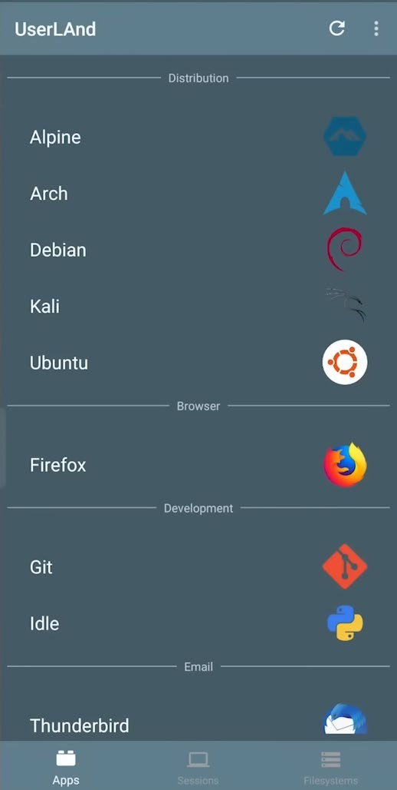

Give the permission needed

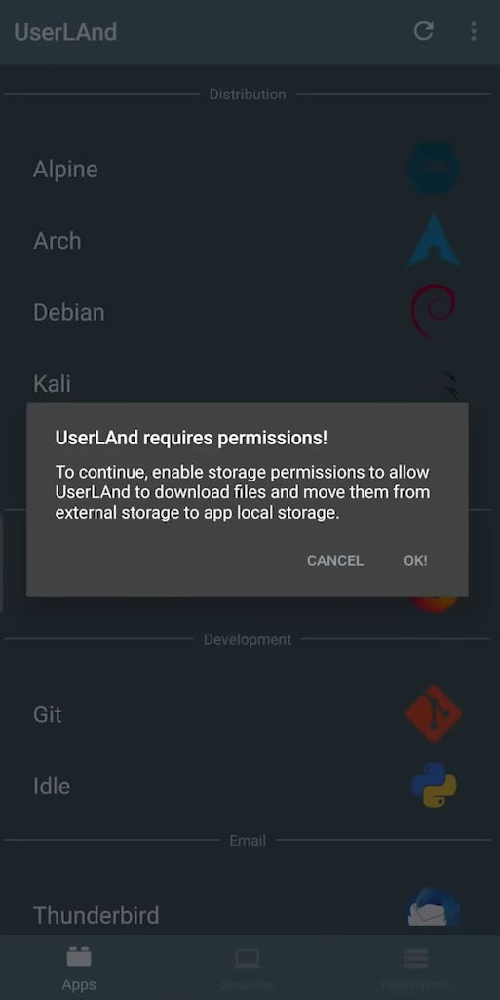
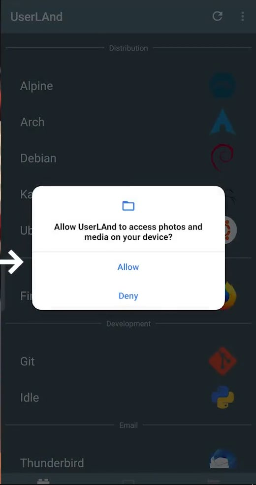

Choose minimal environtment

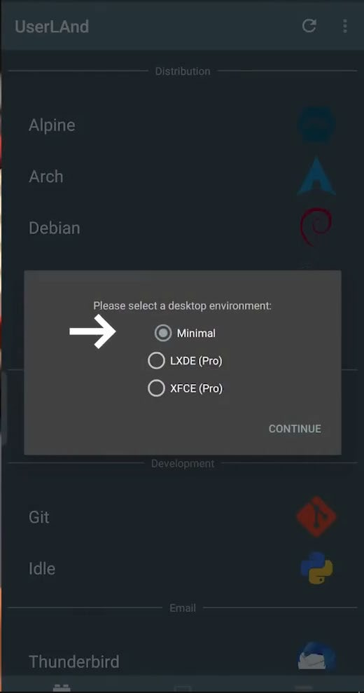

Choose Terminal GUI only so that the server would run smoothly even just running on an android mobile phone

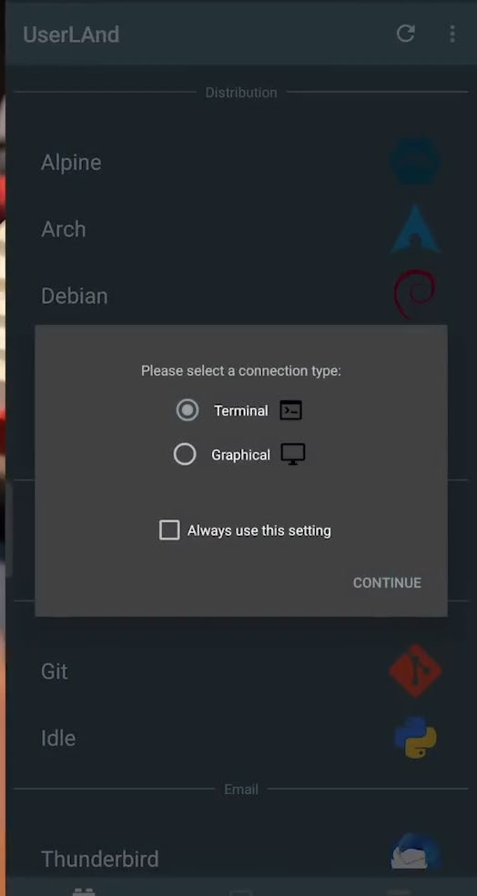
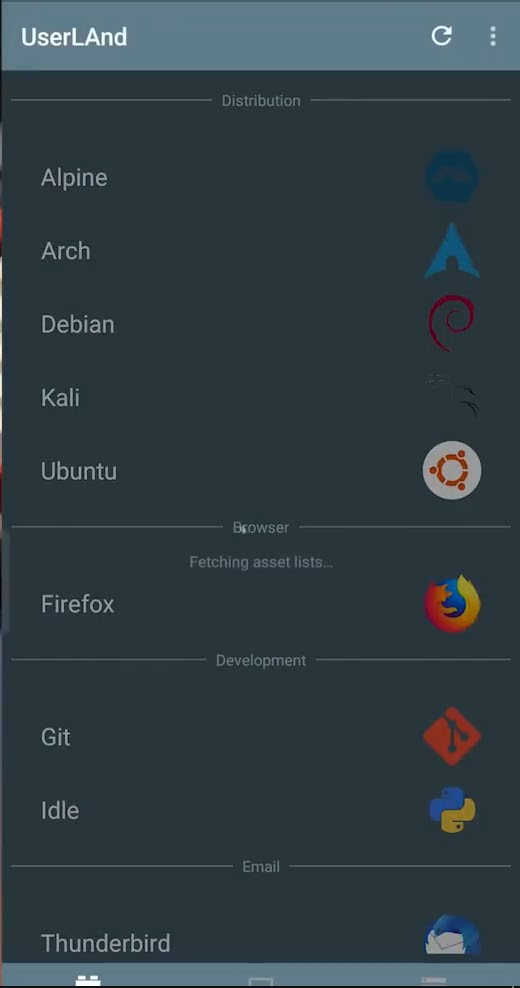

Wait till the process done. Once the process done, the terminal screen will appear.

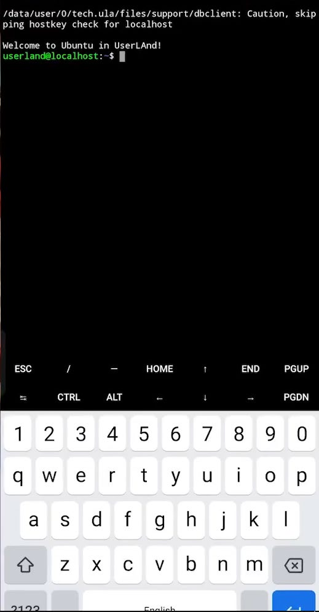

### 2. Server Configuration
First, type sudo su to gain the highest previllege on the server.

Netx, update the password on your server by typing passwd. Type your password 2 times.

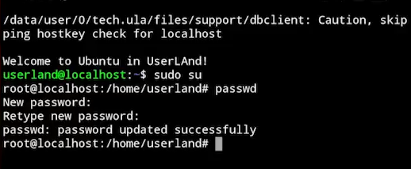

Before beginning any installs, update and upgrade the repository if you haven't already. 

sudo apt update && apt upgrade -y	

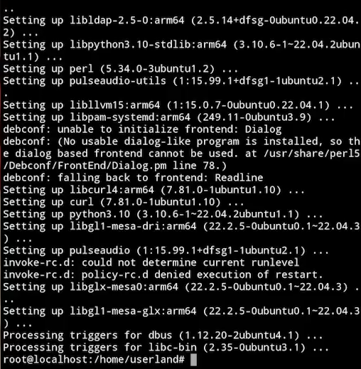!
[Setup Step 10](s/10.png)

Next, install neofetch to verified the version of operating system used.

apt install neofetch -y

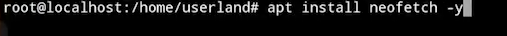

Verify the installation by typing neofetch

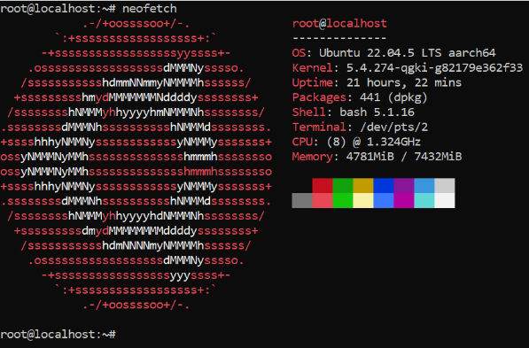

Install net-tools to check device’s IP address. (Author was already installed net-tools)

apt install net-tools -y

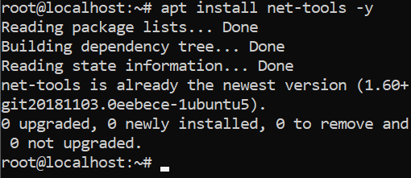

Check device’s IP address using ifconfig. Numbers after ‘inet’ is the device’s IP. Write or just remember it. It will be used later.

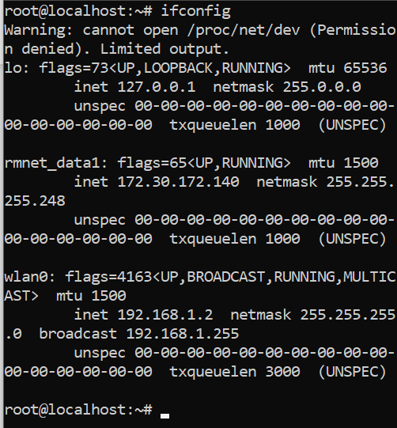

Configuring The Web Server: Web server used on this project is Nginx. 

apt install nginx -y 

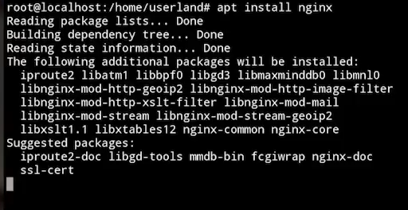

Next, verify the status of nginx (at first, it will show that nginx is not running, but it’s not a problem because nginx is not started yet). Nginx need more configuration and text editor choosen is nano.

service nginx status
apt install nano -y

Next configuration for nginx is changing the default port to 8080. To do this, use command below.

nano /etc/nginx/sites-available/default

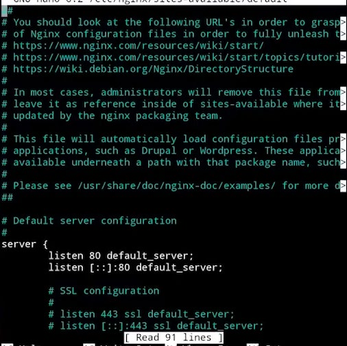

Change “80” to 8080. Click CTRL+X, then press Y, and press Enter button on keyboard to exit from nano and back to terminal.
Next, restart nginx service. Once it’s done restarting, it will show [OK].

service nginx restart

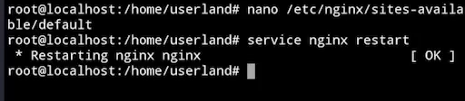

Verify the service by accessing device’s IP:8080 on browser. 
Example: 192.168.1.2:8080

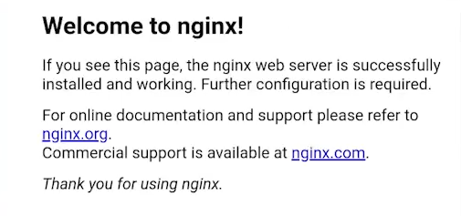

The web server is already working. Next, for changing the welcoming page. Go to default web page’s directory by using comand below.

cd /var/www/html 

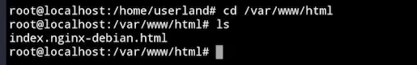

There will be a default file: index.nginx-debian.html. Remove it by command below.

rm -r index.nginx-debian.html

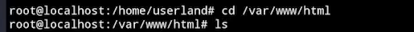

### 3. Domain Setup via Cloudflare
Buy domain, register Cloudflare, set nameservers, disable DNSSEC.

**3.1 Get The Domain.**
Author bouught a cheap domain on idcloudhost.com. 

**3.2 Create Cloudflare Account**
Go to cloudflare.com

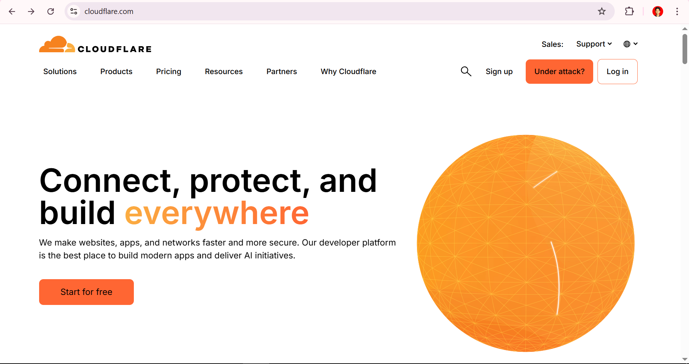

Click Log In and Simply just click Continue with Google and finish the entire process.

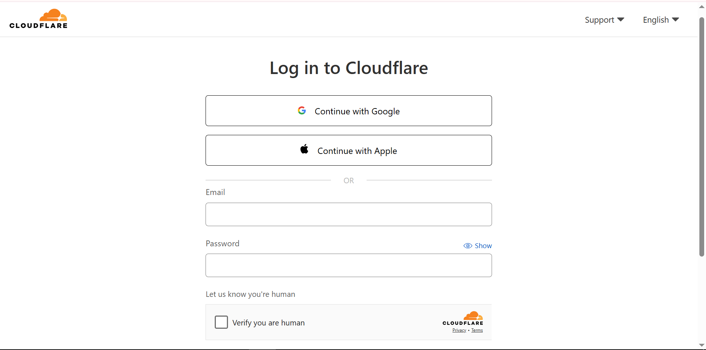

**3.3	Add Domain to Cloudflare**
Picture below is page that will show up after you created an account. Type your domain to available field, choose the Quick scan option, and click continue.

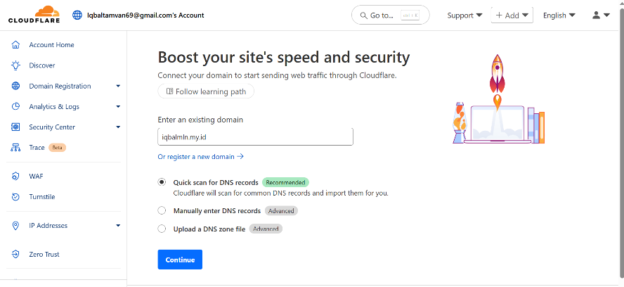

Choose the most suit plan and confirm plan (Author choose the free plan).

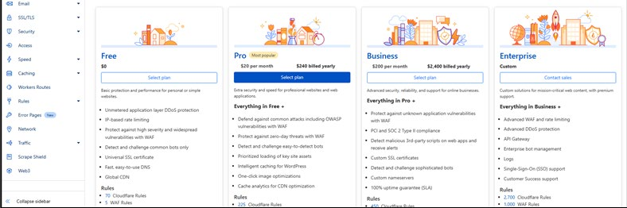

Next, click continue to activation

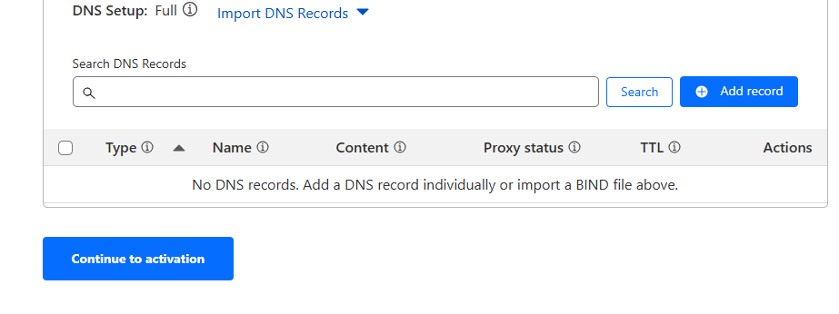

Pay attention to any information that showed on the page.

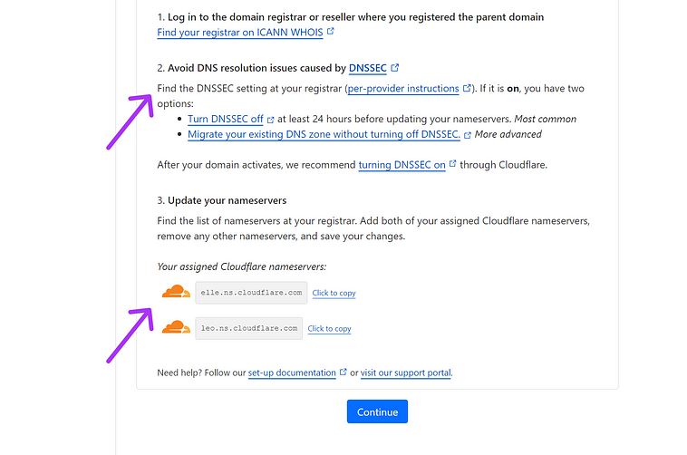

Log in to your domain registrar (Author is using idcloudhost) to turn off DNSSEC and update nameservers.

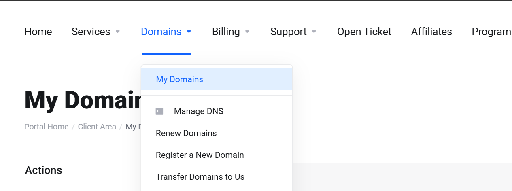

Choose your domain and click the three dots after ‘status’.

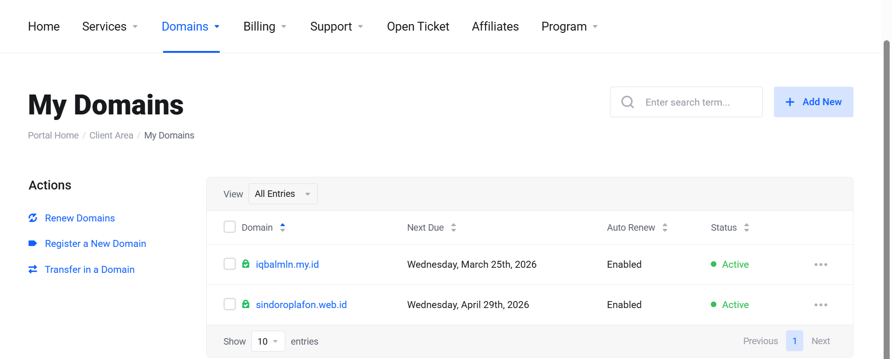

Choose “Manage Nameservers”.

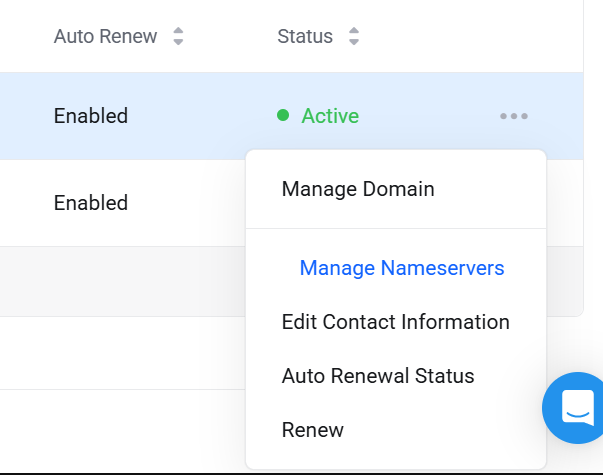

Choose “Use Custom Nameservers” and change the first two default value (given by domain registrar. Example: Sindoro.cloudhost.com) by name server given by cloudflare. Scroll a little bit and click Change Nameservers.

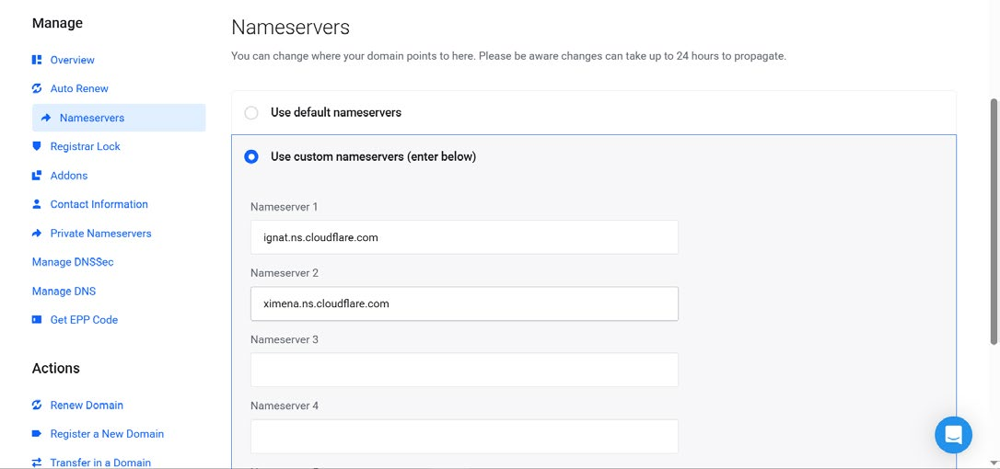

Next, choose Manage DNSSec and make sure there is no DNSSec records found.

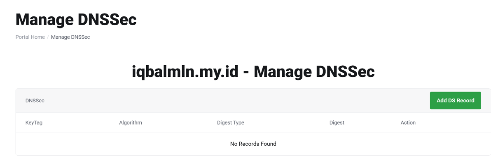

Next, press previous button and choose manage DNS and change the default value (given by domain registrar. Example: Sindoro.cloudhost.com) by name server that given by cloudflare (the same domain that you put on Nameserver). 

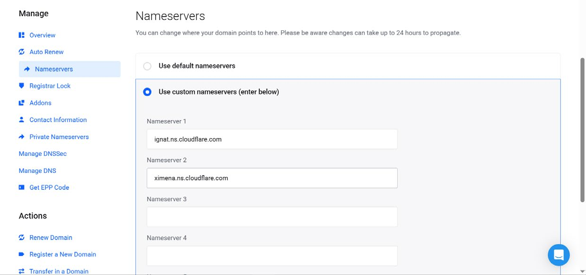

### 4. Cloudflare Tunnel (Zero Trust)
Create tunnel, bind public hostname to `localhost:8080`, validate with domain.

### 5. Blog Deployment
- Create static HTML/CSS site
- Upload to GitHub
- Clone repo to `/var/www/html`
- Use `git pull` to update
- 
## ✅ Project Outcome
### 🎯 Goals Achieved
- Static blog hosted successfully on private server
### 🔐 Security and Reliability
- Cloudflare hides real IP
- Zero Trust ensures validated access
### ⚠️ Limitations
- Android hardware limits performance
- UserLand setup is complex
### 💡 Future Recommendations
- CI/CD with GitHub Actions
- Monitoring with Prometheus/Grafana
- Web performance optimization

## 🌐 Domain
Access: [iqbalmln.my.id](http://iqbalmln.my.id)
## 📬 Contact
Open an issue or PR for suggestions/contributions.
