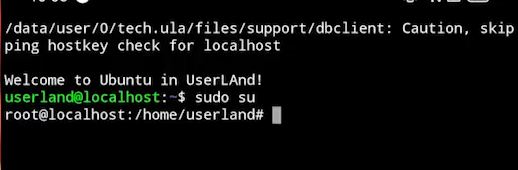
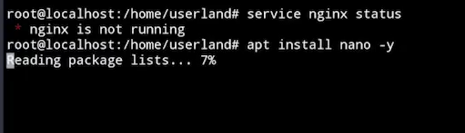

## HOW TO: Create your OWN Hosting by your ANDROID PHONE!
You think hosting service is expensive?? Actually, yes it is lol. But i'll provide you some cheap

## 🔍 System Overview
- Device: Mi 11 Lite (aarch64)
- OS: Ubuntu Server via UserLand
- Web Server: Nginx (port 8080)
- Domain: Managed via Cloudflare
- Access: Cloudflare Tunnel + Zero Trust
- SSL: Provided by Cloudflare

## 🧰 System Requirements
- Hardware: Mi 11 Lite
- Software: UserLand, PuTTY, GitHub, Microsoft Word

## 🏗️ Project Stages
### 1. Preparing the Device
Install Ubuntu on Android using UserLand. Minimal terminal environment is preferred.

### 2. Server Configuration
- `sudo su` to gain root
- `apt update && upgrade`
- Install `neofetch`, `net-tools`, `nano`
- Install Nginx on port `8080`

### 3. Domain Setup via Cloudflare
Buy domain, register Cloudflare, set nameservers, disable DNSSEC.

### 4. Cloudflare Tunnel (Zero Trust)
Create tunnel, bind public hostname to `localhost:8080`, validate with domain.

### 5. Blog Deployment
- Create static HTML/CSS site
- Upload to GitHub
- Clone repo to `/var/www/html`
- Use `git pull` to update
- 
## ✅ Project Outcome
### 🎯 Goals Achieved
- Static blog hosted successfully on private server
### 🔐 Security and Reliability
- Cloudflare hides real IP
- Zero Trust ensures validated access
### ⚠️ Limitations
- Android hardware limits performance
- UserLand setup is complex
### 💡 Future Recommendations
- CI/CD with GitHub Actions
- Monitoring with Prometheus/Grafana
- Web performance optimization

## 🌐 Domain
Access: [iqbalmln.my.id](http://iqbalmln.my.id)
## 📬 Contact
Open an issue or PR for suggestions/contributions.
